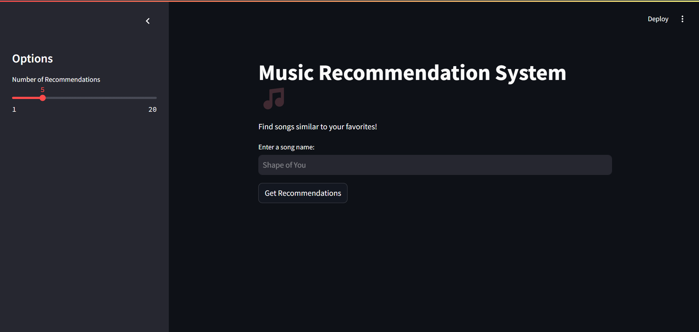
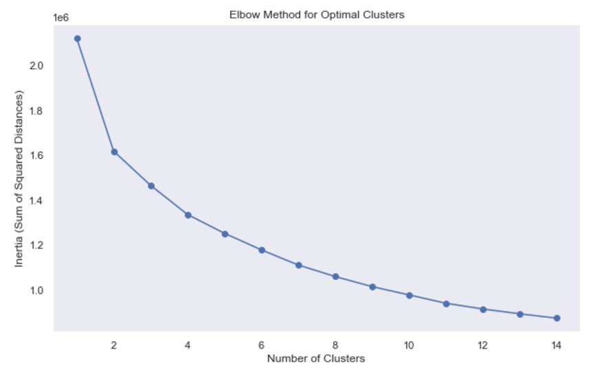
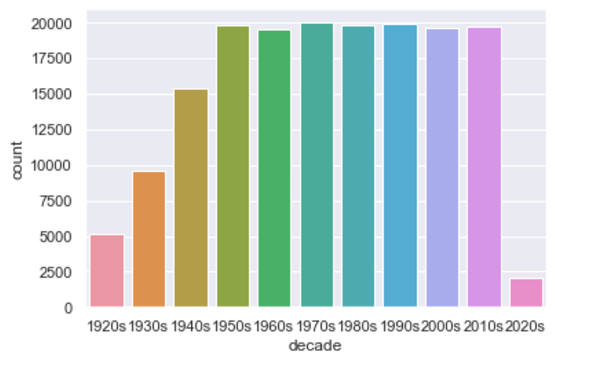
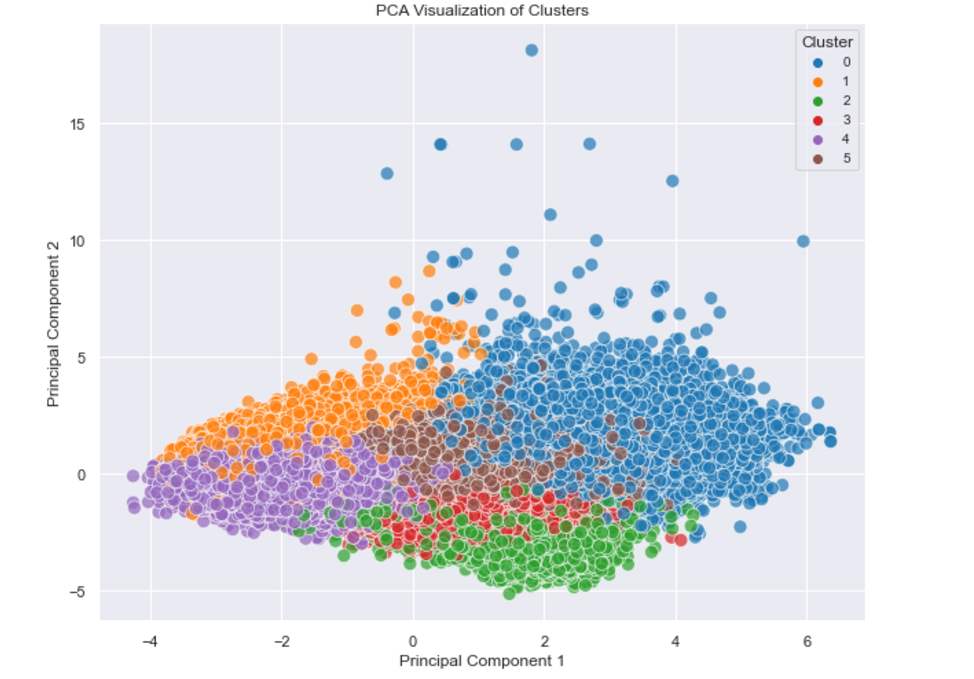
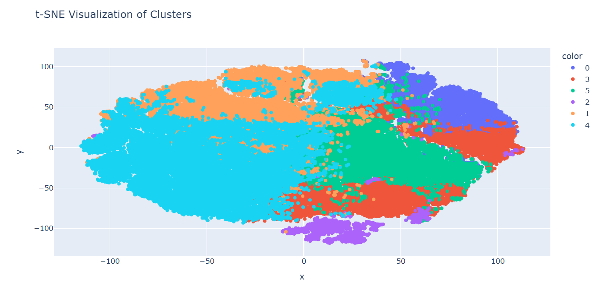
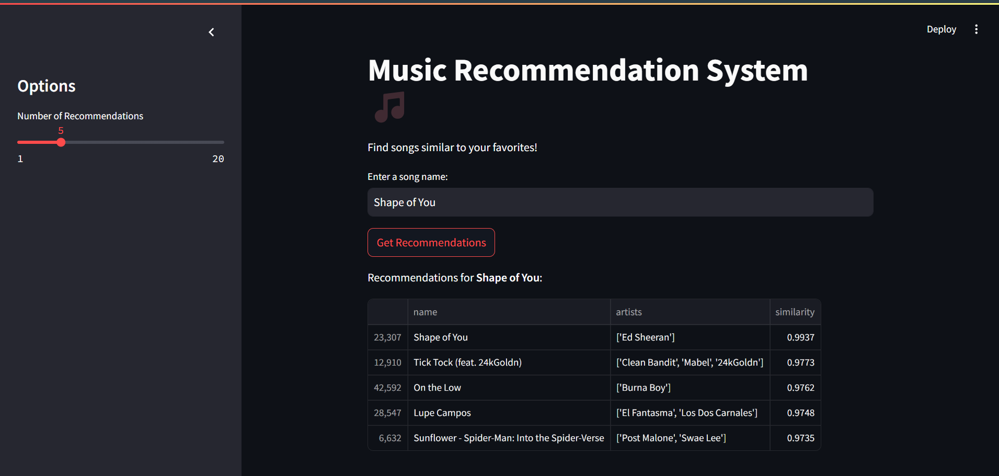

# 🎵 **Music Recommendation System**

An advanced **Music Recommendation System** powered by data science and a comprehensive **Spotify dataset**. This project leverages real-world song data, unsupervised learning, and similarity metrics to deliver personalized music recommendations.


---
## 🌟 Overview

This project demonstrates the application of data science to solve real-world problems in the music industry. By preprocessing, clustering, and analyzing song data, the system provides recommendations for users based on the similarity of features like danceability, energy, and tempo. 

---

## 🌟 **Project Highlights**

- **Real Data**: The dataset includes detailed song-level attributes sourced from Spotify, providing insights into audio characteristics.
- **Unsupervised Learning**: Implements **KMeans Clustering** for grouping similar songs.
- **Similarity-Based Recommendations**: Uses **cosine similarity** to recommend songs closest to user preferences.
- **Interactive Interface**: A clean and user-friendly **Streamlit** web application for seamless user interaction.
- **Data Visualization**: Insightful visualizations showcasing clustering, feature correlations, and distributions.

---

## 🚀 **How It Works**

1. **Data Collection**: 
   - The dataset contains song features like `danceability`, `energy`, `tempo`, and more.
   - Metadata such as song names, artists, popularity, and release year are included for richer insights.

2. **Data Processing**:
   - Standardized numerical features to ensure uniformity using **StandardScaler**.
   - Dimensionality reduction using **PCA** for noise reduction and computational efficiency.

3. **Unsupervised Learning**:
   - **KMeans Clustering** groups songs with similar attributes.
   - Optimal clusters are determined using the **Elbow Method**.
     

4. **Recommendation Generation**:
   - **Cosine Similarity** measures the closeness of songs within a cluster.
   - Recommendations are ranked by similarity score.

5. **Interactive User Interface**:
   - Built with **Streamlit** for a dynamic and easy-to-use app.
   - Users input a song name to get recommendations based on dataset attributes.

---

## 📂 Project Components

- **Data Preprocessing and Clustering**:
  - File: `Music_Clustering_and_Recommendation.py`
  - Steps include data cleaning, normalization, clustering, and model saving.
  
- **Recommendation Engine**:
  - File: `recommendation_engine.py`
  - Implements the recommendation logic with a user-friendly Streamlit interface.

- **Saved Artifacts**:
  - `preprocessed_data.csv`: Preprocessed music data ready for recommendations.
  - `kmeans_model.pkl`: Trained KMeans model for clustering.

## 🚀 How to Run the Project

### Prerequisites

Ensure the following are installed:
- Python 3.8 or higher
- Libraries: Streamlit, Pandas, Scikit-learn, Matplotlib, Seaborn, Plotly

### Steps

1. Clone the repository:

   ```bash
   git clone https://github.com/your-username/music-recommendation-system.git
   cd music-recommendation-system
2. Run the Streamlit app:
   ```bash
   streamlit run recommendation_engine.py
3. Open the URL (usually `http://localhost:8501`) in your browser.
4. Enter a song name and get data-driven recommendations!

   
# 📊 Data Features

### **Features in the Spotify Dataset**
- **Audio Features**:
  - `Danceability`, `Energy`, `Acousticness`, `Instrumentalness`, `Loudness`, `Speechiness`, `Liveness`, `Valence`, `Tempo`
- **Popularity**: Reflects the song’s global reach.
- **Metadata**: Duration (in milliseconds), release year, song name, and artist.

### **Preprocessing**:
- Standardized numerical features for uniform scaling.
- Added a `decade` feature for exploratory analysis.


---

# 🖼️ Visualizations

### **Clustering Visualization (PCA)**:
Clusters are visualized using **Principal Component Analysis (PCA)**, showing clear separations among song groups. Here's an example of the clustering output:


### **Clustering Visualization (t-SNE)**:
To further understand cluster separations, we used **t-SNE** for high-dimensional data visualization:



### **Streamlit Interface**:
A snapshot of the interactive Streamlit interface where users can input a song name and view recommendations:



### **Feature Correlations**:
A **correlation heatmap** highlights the relationships between features, enabling effective feature selection:


---

# 🤖 Data Science Techniques

### **Dimensionality Reduction**:
- PCA and t-SNE for reducing noise and improving cluster interpretability.

### **Unsupervised Learning**:
- KMeans for clustering songs based on similar features.

### **Similarity Metrics**:
- Cosine similarity for ranking song recommendations.

### **Model Evaluation**:
- **Silhouette Scores** and **Elbow Method** for validating clustering performance.

---

# 🔍 Key Insights

- **Data-Driven Approach**: Demonstrates the application of unsupervised learning for personalized recommendation systems.
- **Effective Clustering**: Clustering simplifies the recommendation process by narrowing down candidates.
- **Scalability**: Ready for integration with large-scale datasets or additional features.
- **Interactive Visualizations**: Improves transparency and interpretability of the model’s results.

---

# 🎯 Future Enhancements

### **Real-Time Data Integration**:
- Add more metadata or integrate with live Spotify API data in the future.

### **Advanced Models**:
- Explore deep learning techniques such as Autoencoders for feature extraction.

### **Enhanced Clustering**:
- Experiment with algorithms like DBSCAN or Hierarchical Clustering for better performance on sparse datasets.

---

# 💡 Contributions

Data enthusiasts and developers are welcome! Feel free to fork the repository and submit pull requests to enhance the project.

---
